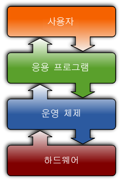
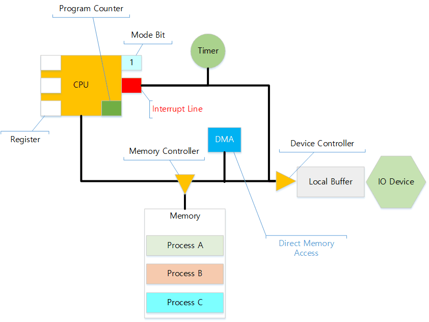

# OS-Concept

운영체제 스터디한 내용을 공유합니다.

내맘대로 재해석해서 옮깁니다. 오류가 있을 수 있습니다. 이슈를 남겨 주세요. :heart:

# 목차

1. [About OS](#about-os)
2. [컴퓨터 시스템 구조](#computer-system)
   - [CPU](#cpu)
3. 프로세스
   - About Process
   - Process Execution
   - Process Memory Structure
   - Process State
   
   - Kernel Memory Structure
   - Process Control Block (PCB)
   - Context Switching
   - System Call
5. CPU 스케줄링
   1. 선점과 비선점 preemptive vs non-preemptive
   2. Scheduling Criteria
      - CPU Utilization
      - Throughput
      - Turnaround Time
      - Waiting Time
      - Response Time
   3. 스케줄링 종류
      - FCFS
      - SJF
      - Priority
      - Round Robin (RR)
      - Multilevel Queue
      - Multilevel Feedback Queue
6. 프로세스 - 동기화
   1. 다중작업
      - MultiProcess (IPC)
        - Message Passing
        - Shared Memory
   2. 문제
      - Race Condition
      - Cirtical Section
      - Kernel Race Condition

7. 메모리 관리
   1. Logical Address vs Physical Address
   2. Dynamic Loading
       1. Paging
       2. Segmentation
       3. Paging and Segmetation
8. 가상 메모리
9. 파일 시스템
10. 

....

## About OS

### 운영체제

운영체제는 컴퓨터 하드웨어와 사용자를 연결해주는 소프트웨어다. 컴퓨터에 대한 모든 소프트웨어적 행동은 운영체제를 경유해 하드웨어를 사용하게 된다.

사용자와 사용자 프로세스는 운영체제가 있어야만 CPU, 메모리, 하드디스크 등 하드웨어(컴퓨터)에 접근할 수 있다. 때문에 켜져 있는 컴퓨터에서는 운영체제가 항상 메모리에 상주하고 있다. 부지런히 자원을 관리하고 사용자의 요청을 처리한다.

운영체제의 가장 큰 관심사는 자원의 효율적 관리다. 유한한 하드웨어와 유한한 성능을 가지고 최대한의 퍼포먼스를 내는 것이다. 더해서 컴퓨터 시스템을 보호하고 사용자와 운영체제 자신을 보호하는데도 목적이 있다.

잠깐, `자원`의 `효율적` `관리` 라고? 다른 분야에서도 관심있는 키워드다. 비즈니스에 OS를 대입해 보자.

집게사장을 상상해보자. 집게사장은 집게리아의 사장이다. 최저시급을 주고 깐깐징어를 고용했다. 깐깐징어는 집게리아에서 햄버거를 만드는 역할을 한다. 깐깐징어는 재료를 가져다 햄버거 만드는 일을 한다.

집게리아에는 여러 햄버거가 메뉴가 있다. 각 햄버거를 만들기 위해서는 빵과 게살, 특별 재료, 소스가 필요하다. 지하 창고에 재료들이 보관되어 있다. 깐깐징어에게는 시간당 월급을 주어야 한다. 욕심 많은 집게사장은 집게리아를 어떻게 운영해야 갑부가 될 수 있을까?

깐깐징어에게 쉼없이 일을 시킨다. 펑펑 놀면서 월급을 받는 꼴을 보면 집게사장은 속이 터질 것 같다. 뭐라도 시켜야 한다. 그렇다고 게살버거를 주문했는데 새우버거를 만들면 안된다. 깐깐징어는 상황에 따라 적절한 일을 해야 한다.

냉장고에는 적절한 재료를 준비해둔다. 멍청한 깐깐징어가 햄버거를 만들 때마다 지하 창고에 내려가면 햄버거 만드는 시간이 너무 오래 걸린다. 한번에 적절한 재료를 냉장고에 넣어 두어야 한다. 같은 햄버거 10개를 만들 때는 10개치 재료를 냉장고에서 꺼내와 가까이 두면 햄버거를 더 빨리 만들 수 있다.

깐깐징어가 불쌍하지만 집게사장은 운영(경영)을 잘해서 갑부가 되었다고 한다...

운영체제도 집게사장과 거의 비슷하다. 가장 비싼 자원인 CPU를 놀리지 않게 한다. 유한한 메모리를 적절히 관리하기 위해서 무엇을 메모리에 올려둘지 제어한다. 하드디스크에 무엇을 어디에 어떻게 저장할지 결정한다. 그리고 이것은 비단 컴퓨터 뿐 아니라 일상생활에서 어느 정도 활용할 수 있다. ~~불쌍한 깐깐징어~~

굳이 집게사장 비유를 든 것도 마찬가지다. 충분히 일상생활에서 있을만한 문제를, 전산학적으로 접근할 뿐이다. OS가 마주한 문제들에 공감하기 시작하면 의외로 쉽게 이해가 가능하다.

### 운영체제의 분류

여러 분류 기준에 따라 운영체제를 나눌 수 있다.

1. 동시작업 가능?
   - 단일 작업 - MS-DOS
   - 다중 작업 - 현대 OS
2. 단일 사용자?
   - 단일 사용자 - Window 
   - 다중 사용자 - UNIX, Linux
3. 처리 방식?
   - 모아서 한방에! Batch
   - 실시간으로 처리! RealTime
   - 시분할 Time Sharing. 현대 OS

### 주요 관심사

**좋은** 운영체제를 위한 문제들이다. 하드웨어 매니징이 가능하면 모두 OS라 부를 수 있겠지만, 다음 문제들을 잘 풀어내야 **좋은 운영체제**가 될 수 있다. 아래 문제를 설명하고 해법을 제시하는게 OS책의 대부분 내용이다.

- CPU 스케줄링
- 프로세스 관리
- 메모리 관리
- 파일 관리
- IO 관리
- 시스템 보호
- 네트워크

## Computer System

### 줄거리

동시에 일어나는 여러 일들을 한번에 이해하기 어려울 수 있다. 세부 항목을 읽으면서 다시 돌아와 그림을 보는게 좋다.

위 구조는 현대 컴퓨터 시스템을 나타낸다. 멀티 태스킹을 지원하는 Time Sharing 방식의 OS가 위 시스템을 제어한다. Interrupt Drive IO라고도 불리는 비동기식 입출력을 사용한다.

CPU와 메모리가 상호작용하면서 작업(프로세스A)을 실행한다. CPU는 메모리에 있는 프로세스의 실행 정보를 Register(캐시는 생략..)에 불러온다. CPU는 Register에 있는 Instruction을 실행한다.

CPU는 Instruction을 실행할 때마다 Program Counter를 변경(증가)시킨다. 

Timer로 부터 Interruption이 발생했다. CPU는 다음 동작을 그만두고 운영체제에 어떻게 할지 물어본다.(Interrupt Handler) CPU는 운영체제가 시키는 대로 다음 작업(프로세스B)을 실행한다.

프로세스B가 운영체제로부터 파일을 읽어달라고 요청했다. 운영체제는 Device Controller에게 명령을 전달하고 CPU는 그동안 다른 작업(프로세스C)을 실행하게 한다. 파일 읽기가 끝나면 Device Controller는 Interrupt를 발생시키거나,  Direct Memory Access을 통해 읽은 내용을 메모리에 전달한다. 

-반복-

뭔 소리래? ...

### CPU

- Instruction
- Register
- Mode Bit
- Program Counter
- Interrupt Line

#### Instruction

CPU 명령 집합을 Instruction이라고 부른다. 모든 프로그래밍 언어는 실행시 기계어로 바뀐다. 즉, CPU가 이해할 수 있는 Instruction으로 바꾸어 CPU가 처리하도록 한다. 기계어로 바뀌는 과정에 따라 컴파일 언어, 인터프리터 언어로 구분할 뿐이다.

CPU가 실행하는 Instruction은 여러 종류가 있다. 이 맥락에서 짚어야 할 것은 CPU의 실행 모드(Mode Bit)에 따라 실행할 수 있는 Instruction이 다르다는 것이다. 커널모드(Mode Bit 0)에서는 모든 Instruction을 실행할 수 있고 유저 모드(Mode Bit 1)에서는 일부 Instruction만 가능하다.

얼마전 이슈가 되었던 인텔 CPU의 멜트다운도 이 맥락에서 이해가 가능하다. 원래 유저는 커널모드의 Instruction을 실행할 수 없다. 그러나 CPU 실행 과정에서 간접적으로 커널 영역의 값을 알아낼 수 있는 방법이 알려졌고, 멜트다운으로 명명되었다. 자세한 내용은 구글에 검색하면 잘 나온다. 보다보면 CPU 동작 방식을 유추해 볼 수 있다. 캐시, 레지스터, 커널 등이 언급된다.

#### Register

레지스터, Cache(캐시), 메모리, SSD, HDD, CD... 모두 저장 장치다. 0과 1로 이루어진 이진 정보를 보관하는 역할을 한다. 순서대로 레지스터가 가장 빠르고 CD가 가장 느리다. 이를 메모리 계층(Memory Hierarchy)이라 부른다. 다 같은 저장장치지만 속도와 쓰임새가 다르다.

레지스터와 Cache는 CPU 안에 있는 저장장치다. 가장 빠르다. 빠른 축에 속한 RAM보다 훨씬 빠르다. 그래서 RAM보다 빠른 레지스터를 CPU가까이 두고 CPU가 전용으로 쓰도록 한다.

메모리 계층에 관한 유튜브 영상.

#### Mode Bit

0과 1로만 구성된 특별한 비트다. 0은 커널모드, 1은 유저모드를 의미한다. CPU는 자신이 처리해야 할 명령을 메모리(프로세스)로부터 받는다. CPU는 스스 처리해야 할 Instruction이 적절한지 Mode Bit을 보고 판단한다. Mode Bit이 1이면 파일시스템 접근 Instruction을 실행할 수 없음을 인지하고 운영체제에 이 사실을 일러버린다. 운영체제는 프로세스를 참교육(Abort)시킨다.

그럼 프로세스는 파일 시스템에 직접 접근할 방법이 없나? 없다. 대신, 커널을 통해서 접근할 수 있다. 프로세스가 커널에게 "A파일 정보를 주세요"라고 부탁한다. 커널은 요청을 검사하고(유저가 권한이 없거나...등)  문제가 없으면 CPU에게 파일을 읽게 한다. 파일읽기가 끝나면 커널이 프로세스에게 파일정보를 넘겨준다.

이처럼 유저 프로세스가 커널에게 "부탁" 하는 것을 "시스템 콜"이라고 부른다. 정확히는 프로세스가 커널 함수를 호출하는 것을 시스템 콜이라고 한다. 커널은 프로세스가 하드웨어를 적절히 이용할 수 있도록 여러 커널 함수를 지원하고 있다.

커널이 프로세스에게 무언가를 넘겨주는 것에 주목해보자. 프로세스끼리는 서로 통신할 수 없다. 메모리 영역도 다르고 어떤 프로세스가 CPU를 쓰고 있으면 다른 프로세스는 CPU를 쓸 수 없기 때문이다. 하지만 커널이 프로세스 사이에서 데이터를 넘겨줄수 있다. 커널은 프로세스에 관한 정보를 알고 있으므로 A프로세스와 B프로세스 사이에서 데이터를 전달해 줄수 있다. 이렇게 프로세스간 통신을 Inter Process Communication(IPC)라고 부르고 커널을 통한 전달 방식을 Message Passing이라고 부른다.

#### Program Counter

멀티 태스킹하는 스스로를 생각해보자. 책을 읽다가 전화가 왔다. 책 읽기를 잠시 멈추고 전화를 받는다. 통화가 끝나고 다시 책을 읽는다. 어디부터? 마지막까지 읽은 곳부터. 컴퓨터는 "책의 마지막까지 읽은 곳"을 Program Counter에 기록한다.

다중 작업을 지원하는 운영체제에서는 어떤 작업이 CPU를 언제든지 뺏길 수 있다. 언제 뺏길지 아무도 알 수 없는(예측할 수 없는) 상황이다. CPU를 뺏겼다가 다시 실행하면 처음부터 실행하나? 그러려면 멀티태스킹 안하고 말지. 운영체제는 프로세스 실행의 맥락(Context)를 보관해야 할 필요가 생겼다. 그러나 프로세스가 실행 중일때(유저 모드일때) 일어나는 상황은 운영체제도 모른다. (유저 프로세스가 CPU를 사용중이므로 == 커널이 CPU를 사용하고 있지 않으므로) 그래서 CPU가 하드웨어적으로 Context를 기록하게 한다. 이게 Program Counter다. CPU는 Instruction을 실행할 때마다 Program Counter를 증가시킨다. CPU를 차지하는 작업이 바뀔 때마다 CPU는 운영체제에 Program Counter를 보고한다. 운영체제는 프로세스들의  Program Counter를 기록해 둔다. 프로세스가 재실행될 때 Program Counter를 같이 전달해서 직전 실행 다음부터 실행할 수 있게 한다. 

실행중인 프로세스를 중단하고 다른 프로세스를 실행시키기 위해 맥락을 바꾸는 것을 Context Switching이라고 한다. Context Switching은 비교적 비용이 큰 작업이다. 이전까지 하던 모든 것을 잊고(캐시와 레지스터를 비우고) 새로 할 작업을 준비(메모리로부터 캐시와 레지스터를 채우는)하기 때문이다. 그렇다고 프로세스를 바꿔주지 않으면 동시 작업이 불가능하다. 이처럼 어떻게 적절히 프로세스를 실행시킬 것인지 하는 이슈를 다루는 단원이 CPU 스케줄링이다.

#### Interrupt

멀티태스킹을 가능하게 하는 요소다. 문자 그대로 CPU를 방해한다. CPU는 명령을 실행하고 나서 Interrupt Line을 검사한다. Interrupt가 없으면 다음 명령을 실행하고 있으면 Mode Bit을 0으로 바꾼뒤 (커널모드) 커널을 실행한다. 커널에는 Interrupt Handler Routine 인터럽트 핸들러가 있다. 커널은 나름대로의 알고리즘을 통해 이후 무엇을 어떻게 처리할지 결정한다. 커널은 Mode Bit을 1로 바꾸고 다음 작업을 실행하도록 한다.

Interrupt는 두가지 요소가 발생시킨다.

1. Timer

커널은 유저 프로세스에게 CPU를 할당해 주면서 CPU 사용 시간도 같이 할당한다. 커널은 유저 프로세스를 실행시키면서 Timer 하드웨어에 시간을 입력한다. Timer는 시간이 되면 Interrupt를 발생시킨다.

어디서 많이 본 느낌이다. 자바스크립트 비동기 동작 방식과 매우 유사하다. 콜스택에서 브라우저 API를 호출하고 타이머에 달아뒀다가 다시 콜스택에 옮기는 일련의 과정. Interrupt를 통한 강제적 점유 빼고 매우 흡사하다.

2. IO 컨트롤러

CPU는 무지하게 빠르다. 상대적으로 느린(백만배 이상 느린) IO장치를 넋놓고 기다리기엔 운영체제가 호락호락하지 않다. IO이 끝날 때까지 운영체제는 CPU가 기다리지 않고 다른 일을 하도록 한다. IO이 끝나면, IO를 요청한 프로세스가 이어서 실행될 수 있어야 한다. 각 Device Controller는 IO이 끝난 것을 Interrupt를 발생시켜 알린다. 

그러나 너무 자주 Interrupt를 발생시키면 비효율적(Context Switching)이므로 Interrupt를 발생시키지 않고 바로 메모리에 로드할 수도 있다. 이를 관장하는게 Direct Memory Access다.
